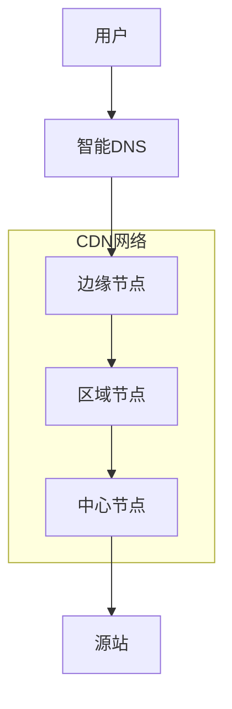

# CDN 内容分发网络

## 简介
### 🌐 什么是 CDN

CDN（Content Delivery Network，内容分发网络）是一种分布式网络架构，通过在全球各地部署边缘服务器，将内容缓存到离用户最近的节点，从而提高内容传输速度和用户体验。

### 核心优势
- **加速访问**：就近访问，减少延迟
- **减轻负载**：分担源站压力
- **提高可用性**：多节点冗余
- **节省带宽**：减少源站带宽消耗
- **安全防护**：DDoS 防护、WAF 等

### 工作原理
1. **用户请求**：用户访问网站资源
2. **DNS 解析**：智能 DNS 返回最优节点 IP
3. **边缘服务**：CDN 节点处理请求
4. **缓存命中**：返回缓存内容或回源获取
5. **内容传输**：将内容传输给用户

## CDN 架构设计
### 分层架构



### 节点分布策略

```javascript
// CDN 节点配置
const cdnConfig = {
  // 全球节点分布
  regions: {
    'asia-pacific': {
      nodes: [
        { city: 'tokyo', country: 'japan', capacity: '10Gbps' },
        { city: 'singapore', country: 'singapore', capacity: '10Gbps' },
        { city: 'seoul', country: 'south-korea', capacity: '5Gbps' },
        { city: 'mumbai', country: 'india', capacity: '5Gbps' }
      ]
    },
    'north-america': {
      nodes: [
        { city: 'new-york', country: 'usa', capacity: '20Gbps' },
        { city: 'los-angeles', country: 'usa', capacity: '15Gbps' },
        { city: 'chicago', country: 'usa', capacity: '10Gbps' },
        { city: 'toronto', country: 'canada', capacity: '5Gbps' }
      ]
    },
    'europe': {
      nodes: [
        { city: 'london', country: 'uk', capacity: '15Gbps' },
        { city: 'frankfurt', country: 'germany', capacity: '10Gbps' },
        { city: 'paris', country: 'france', capacity: '8Gbps' },
        { city: 'amsterdam', country: 'netherlands', capacity: '8Gbps' }
      ]
    }
  },
  
  // 智能调度策略
  routing: {
    algorithm: 'geolocation-latency',
    fallback: 'round-robin',
    healthCheck: {
      interval: 30,
      timeout: 5,
      retries: 3
    }
  }
}
```

## 主流 CDN 服务商
### 国际服务商

#### Cloudflare 配置

```javascript
// Cloudflare Workers 边缘计算
addEventListener('fetch', event => {
  event.respondWith(handleRequest(event.request))
})

async function handleRequest(request) {
  const url = new URL(request.url)
  const cache = caches.default
  
  // 缓存键
  const cacheKey = new Request(url.toString(), request)
  
  // 检查缓存
  let response = await cache.match(cacheKey)
  
  if (!response) {
    // 回源获取
    response = await fetch(request)
    
    // 设置缓存头
    const modifiedResponse = new Response(response.body, {
      status: response.status,
      statusText: response.statusText,
      headers: {
        ...response.headers,
        'Cache-Control': 'public, max-age=86400',
        'CDN-Cache-Status': 'MISS'
      }
    })
    
    // 缓存响应
    event.waitUntil(cache.put(cacheKey, modifiedResponse.clone()))
    return modifiedResponse
  }
  
  // 添加缓存状态头
  const cachedResponse = new Response(response.body, {
    status: response.status,
    statusText: response.statusText,
    headers: {
      ...response.headers,
      'CDN-Cache-Status': 'HIT'
    }
  })
  
  return cachedResponse
}
```

#### AWS CloudFront 配置

```yaml
# cloudfront-distribution.yml
AWSTemplateFormatVersion: '2010-09-09'
Description: 'CloudFront Distribution for Static Website'

Parameters:
  DomainName:
    Type: String
    Description: 'Domain name for the website'
    Default: 'example.com'
  
  S3BucketName:
    Type: String
    Description: 'S3 bucket name for static content'

Resources:
  CloudFrontDistribution:
    Type: AWS::CloudFront::Distribution
    Properties:
      DistributionConfig:
        # 域名配置
        Aliases:
          - !Ref DomainName
          - !Sub 'www.${DomainName}'
        
        # 源站配置
        Origins:
          - Id: S3Origin
            DomainName: !Sub '${S3BucketName}.s3.amazonaws.com'
            S3OriginConfig:
              OriginAccessIdentity: !Sub 'origin-access-identity/cloudfront/${OriginAccessIdentity}'
          
          - Id: APIOrigin
            DomainName: 'api.example.com'
            CustomOriginConfig:
              HTTPPort: 80
              HTTPSPort: 443
              OriginProtocolPolicy: 'https-only'
              OriginSSLProtocols:
                - TLSv1.2
        
        # 缓存行为
        DefaultCacheBehavior:
          TargetOriginId: S3Origin
          ViewerProtocolPolicy: 'redirect-to-https'
          CachePolicyId: '4135ea2d-6df8-44a3-9df3-4b5a84be39ad'  # Managed-CachingOptimized
          OriginRequestPolicyId: '88a5eaf4-2fd4-4709-b370-b4c650ea3fcf'  # Managed-CORS-S3Origin
          ResponseHeadersPolicyId: '5cc3b908-e619-4b99-88e5-2cf7f45965bd'  # Managed-SecurityHeadersPolicy
          Compress: true
        
        CacheBehaviors:
          # API 路径
          - PathPattern: '/api/*'
            TargetOriginId: APIOrigin
            ViewerProtocolPolicy: 'https-only'
            CachePolicyId: '4135ea2d-6df8-44a3-9df3-4b5a84be39ad'
            AllowedMethods:
              - GET
              - HEAD
              - OPTIONS
              - PUT
              - POST
              - PATCH
              - DELETE
            CachedMethods:
              - GET
              - HEAD
              - OPTIONS
          
          # 静态资源
          - PathPattern: '/static/*'
            TargetOriginId: S3Origin
            ViewerProtocolPolicy: 'https-only'
            CachePolicyId: '658327ea-f89d-4fab-a63d-7e88639e58f6'  # Managed-CachingOptimizedForUncompressedObjects
            Compress: true
        
        # 全局设置
        Enabled: true
        HttpVersion: 'http2'
        PriceClass: 'PriceClass_All'
        
        # 自定义错误页面
        CustomErrorResponses:
          - ErrorCode: 404
            ResponseCode: 200
            ResponsePagePath: '/index.html'
            ErrorCachingMinTTL: 300
          - ErrorCode: 403
            ResponseCode: 200
            ResponsePagePath: '/index.html'
            ErrorCachingMinTTL: 300
        
        # 地理限制
        Restrictions:
          GeoRestriction:
            RestrictionType: 'none'
        
        # SSL 证书
        ViewerCertificate:
          AcmCertificateArn: !Ref SSLCertificate
          SslSupportMethod: 'sni-only'
          MinimumProtocolVersion: 'TLSv1.2_2021'
        
        # 日志配置
        Logging:
          Bucket: !Sub '${LoggingBucket}.s3.amazonaws.com'
          IncludeCookies: false
          Prefix: 'cloudfront-logs/'

  # Origin Access Identity
  OriginAccessIdentity:
    Type: AWS::CloudFront::CloudFrontOriginAccessIdentity
    Properties:
      CloudFrontOriginAccessIdentityConfig:
        Comment: !Sub 'OAI for ${DomainName}'

  # SSL 证书
  SSLCertificate:
    Type: AWS::CertificateManager::Certificate
    Properties:
      DomainName: !Ref DomainName
      SubjectAlternativeNames:
        - !Sub '*.${DomainName}'
      ValidationMethod: DNS
      DomainValidationOptions:
        - DomainName: !Ref DomainName
          HostedZoneId: !Ref HostedZone

Outputs:
  DistributionId:
    Description: 'CloudFront Distribution ID'
    Value: !Ref CloudFrontDistribution
  
  DistributionDomainName:
    Description: 'CloudFront Distribution Domain Name'
    Value: !GetAtt CloudFrontDistribution.DomainName
```

### 国内服务商

#### 阿里云 CDN 配置

```python
# 阿里云 CDN Python SDK 配置
from aliyunsdkcore.client import AcsClient
from aliyunsdkcdn.request.v20180510 import AddCdnDomainRequest, DescribeCdnDomainDetailRequest
import json

class AliyunCDN:
    def __init__(self, access_key_id, access_key_secret, region='cn-hangzhou'):
        self.client = AcsClient(access_key_id, access_key_secret, region)
    
    def add_domain(self, domain_name, sources):
        """添加 CDN 域名"""
        request = AddCdnDomainRequest.AddCdnDomainRequest()
        request.set_DomainName(domain_name)
        request.set_CdnType('web')  # web, download, video
        request.set_Sources(json.dumps(sources))
        
        # 设置缓存规则
        cache_config = {
            'rules': [
                {
                    'pathPattern': '*.jpg,*.png,*.gif,*.webp',
                    'ttl': 86400,
                    'weight': 1
                },
                {
                    'pathPattern': '*.css,*.js',
                    'ttl': 3600,
                    'weight': 2
                },
                {
                    'pathPattern': '*.html',
                    'ttl': 600,
                    'weight': 3
                }
            ]
        }
        
        try:
            response = self.client.do_action_with_exception(request)
            return json.loads(response)
        except Exception as e:
            print(f"Error adding domain: {e}")
            return None
    
    def configure_cache_rules(self, domain_name):
        """配置缓存规则"""
        # 这里可以添加更详细的缓存配置
        pass
    
    def configure_https(self, domain_name, cert_name, cert_content, private_key):
        """配置 HTTPS"""
        # HTTPS 配置
        pass

# 使用示例
cdn = AliyunCDN('your_access_key', 'your_secret_key')

# 添加域名
sources = [
    {
        'content': 'origin.example.com',
        'type': 'domain',
        'port': 80,
        'priority': 20,
        'weight': 10
    }
]

result = cdn.add_domain('cdn.example.com', sources)
print(result)
```

#### 腾讯云 CDN 配置

```javascript
// 腾讯云 CDN Node.js SDK
const tencentcloud = require('tencentcloud-sdk-nodejs')

const CdnClient = tencentcloud.cdn.v20180606.Client

class TencentCDN {
  constructor(secretId, secretKey, region = 'ap-beijing') {
    const clientConfig = {
      credential: {
        secretId: secretId,
        secretKey: secretKey
      },
      region: region,
      profile: {
        httpProfile: {
          endpoint: 'cdn.tencentcloudapi.com'
        }
      }
    }
    
    this.client = new CdnClient(clientConfig)
  }
  
  async addDomain(domain, origins) {
    const params = {
      Domain: domain,
      ServiceType: 'web',
      Origin: {
        Origins: origins,
        OriginType: 'domain',
        ServerName: domain
      },
      Cache: {
        SimpleCache: {
          CacheRules: [
            {
              CacheType: 'file',
              CacheContents: ['jpg', 'png', 'gif', 'webp'],
              CacheTime: 86400
            },
            {
              CacheType: 'file',
              CacheContents: ['css', 'js'],
              CacheTime: 3600
            },
            {
              CacheType: 'file',
              CacheContents: ['html'],
              CacheTime: 600
            }
          ]
        }
      },
      Compression: {
        Switch: 'on',
        CompressionRules: [
          {
            Compress: true,
            FileExtensions: ['js', 'html', 'css', 'xml', 'json', 'shtml', 'htm']
          }
        ]
      }
    }
    
    try {
      const result = await this.client.AddCdnDomain(params)
      return result
    } catch (error) {
      console.error('Error adding CDN domain:', error)
      throw error
    }
  }
  
  async purgeCache(urls) {
    const params = {
      Urls: urls,
      Area: 'mainland'
    }
    
    try {
      const result = await this.client.PurgeUrlsCache(params)
      return result
    } catch (error) {
      console.error('Error purging cache:', error)
      throw error
    }
  }
}

// 使用示例
const cdn = new TencentCDN('your_secret_id', 'your_secret_key')

// 添加域名
const origins = ['origin.example.com']
cdn.addDomain('cdn.example.com', origins)
  .then(result => console.log('Domain added:', result))
  .catch(error => console.error('Error:', error))
```

## 缓存策略
### 缓存规则设计

```javascript
// CDN 缓存策略配置
const cacheStrategy = {
  // 静态资源缓存
  staticAssets: {
    images: {
      extensions: ['jpg', 'jpeg', 'png', 'gif', 'webp', 'svg', 'ico'],
      ttl: 86400 * 30, // 30 天
      headers: {
        'Cache-Control': 'public, max-age=2592000, immutable',
        'Expires': new Date(Date.now() + 86400 * 30 * 1000).toUTCString()
      }
    },
    
    fonts: {
      extensions: ['woff', 'woff2', 'ttf', 'eot', 'otf'],
      ttl: 86400 * 365, // 1 年
      headers: {
        'Cache-Control': 'public, max-age=31536000, immutable',
        'Access-Control-Allow-Origin': '*'
      }
    },
    
    scripts: {
      extensions: ['js', 'css'],
      ttl: 86400 * 7, // 7 天
      headers: {
        'Cache-Control': 'public, max-age=604800',
        'Vary': 'Accept-Encoding'
      }
    }
  },
  
  // 动态内容缓存
  dynamicContent: {
    api: {
      paths: ['/api/v1/products', '/api/v1/categories'],
      ttl: 300, // 5 分钟
      headers: {
        'Cache-Control': 'public, max-age=300',
        'Vary': 'Accept, Accept-Encoding'
      },
      conditions: {
        methods: ['GET'],
        excludeParams: ['timestamp', 'random']
      }
    },
    
    pages: {
      paths: ['/', '/about', '/contact'],
      ttl: 3600, // 1 小时
      headers: {
        'Cache-Control': 'public, max-age=3600',
        'Vary': 'Accept-Encoding, Cookie'
      }
    }
  },
  
  // 不缓存规则
  noCache: {
    paths: ['/admin/*', '/user/profile', '/api/auth/*'],
    headers: {
      'Cache-Control': 'no-cache, no-store, must-revalidate',
      'Pragma': 'no-cache',
      'Expires': '0'
    }
  }
}

// 缓存策略应用函数
function applyCacheStrategy(request, response) {
  const url = new URL(request.url)
  const pathname = url.pathname
  const extension = pathname.split('.').pop()?.toLowerCase()
  
  // 检查不缓存规则
  for (const path of cacheStrategy.noCache.paths) {
    if (pathname.match(new RegExp(path.replace('*', '.*')))) {
      Object.entries(cacheStrategy.noCache.headers).forEach(([key, value]) => {
        response.setHeader(key, value)
      })
      return
    }
  }
  
  // 静态资源缓存
  for (const [type, config] of Object.entries(cacheStrategy.staticAssets)) {
    if (config.extensions.includes(extension)) {
      Object.entries(config.headers).forEach(([key, value]) => {
        response.setHeader(key, value)
      })
      return
    }
  }
  
  // 动态内容缓存
  for (const [type, config] of Object.entries(cacheStrategy.dynamicContent)) {
    for (const path of config.paths) {
      if (pathname === path || pathname.startsWith(path)) {
        if (!config.conditions || 
            (config.conditions.methods?.includes(request.method) ?? true)) {
          Object.entries(config.headers).forEach(([key, value]) => {
            response.setHeader(key, value)
          })
          return
        }
      }
    }
  }
  
  // 默认缓存策略
  response.setHeader('Cache-Control', 'public, max-age=300')
}
```

### 缓存失效策略

```javascript
// 缓存失效管理
class CacheInvalidation {
  constructor(cdnProvider) {
    this.cdnProvider = cdnProvider
    this.invalidationQueue = []
    this.batchSize = 100
    this.batchInterval = 5000 // 5 秒
  }
  
  // 添加失效任务
  addInvalidation(urls, tags = []) {
    const task = {
      urls: Array.isArray(urls) ? urls : [urls],
      tags: tags,
      timestamp: Date.now()
    }
    
    this.invalidationQueue.push(task)
    this.processBatch()
  }
  
  // 批量处理失效
  async processBatch() {
    if (this.invalidationQueue.length === 0) return
    
    const batch = this.invalidationQueue.splice(0, this.batchSize)
    const allUrls = batch.flatMap(task => task.urls)
    const allTags = [...new Set(batch.flatMap(task => task.tags))]
    
    try {
      // URL 失效
      if (allUrls.length > 0) {
        await this.cdnProvider.purgeUrls(allUrls)
        console.log(`Purged ${allUrls.length} URLs`)
      }
      
      // 标签失效
      if (allTags.length > 0) {
        await this.cdnProvider.purgeTags(allTags)
        console.log(`Purged ${allTags.length} tags`)
      }
    } catch (error) {
      console.error('Cache invalidation failed:', error)
      // 重新加入队列
      this.invalidationQueue.unshift(...batch)
    }
    
    // 继续处理剩余任务
    if (this.invalidationQueue.length > 0) {
      setTimeout(() => this.processBatch(), this.batchInterval)
    }
  }
  
  // 智能失效策略
  smartInvalidation(changeType, affectedResources) {
    switch (changeType) {
      case 'content_update':
        // 内容更新：失效相关页面和 API
        this.addInvalidation([
          '/',
          '/sitemap.xml',
          ...affectedResources.pages,
          ...affectedResources.apis
        ], ['content', 'pages'])
        break
        
      case 'asset_update':
        // 资源更新：失效特定文件
        this.addInvalidation(affectedResources.files)
        break
        
      case 'config_change':
        // 配置变更：全站失效
        this.addInvalidation(['/*'], ['all'])
        break
        
      case 'user_action':
        // 用户操作：失效用户相关缓存
        this.addInvalidation([
          `/user/${affectedResources.userId}/*`,
          '/api/user/profile'
        ], ['user'])
        break
    }
  }
}

// 使用示例
const cacheManager = new CacheInvalidation(cdnProvider)

// 内容发布后失效缓存
cacheManager.smartInvalidation('content_update', {
  pages: ['/blog/new-post', '/blog'],
  apis: ['/api/posts', '/api/posts/latest']
})
```

## 性能优化
### 图片优化

```javascript
// 图片优化服务
class ImageOptimization {
  constructor() {
    this.supportedFormats = ['webp', 'avif', 'jpeg', 'png']
    this.qualitySettings = {
      high: 90,
      medium: 75,
      low: 60
    }
  }
  
  // 智能格式选择
  selectOptimalFormat(userAgent, originalFormat) {
    // 检查浏览器支持
    if (userAgent.includes('Chrome') || userAgent.includes('Firefox')) {
      return 'webp'
    }
    
    if (userAgent.includes('Safari') && !userAgent.includes('Chrome')) {
      return originalFormat === 'png' ? 'png' : 'jpeg'
    }
    
    return originalFormat
  }
  
  // 响应式图片处理
  generateResponsiveImages(originalUrl, sizes = [320, 640, 1024, 1920]) {
    const baseUrl = originalUrl.replace(/\.[^.]+$/, '')
    const extension = originalUrl.split('.').pop()
    
    return sizes.map(size => ({
      url: `${baseUrl}_${size}w.${extension}`,
      width: size,
      descriptor: `${size}w`
    }))
  }
  
  // 图片 URL 生成
  generateImageUrl(originalUrl, options = {}) {
    const {
      width,
      height,
      quality = 'medium',
      format,
      crop = 'smart'
    } = options
    
    const params = new URLSearchParams()
    
    if (width) params.append('w', width)
    if (height) params.append('h', height)
    if (format) params.append('f', format)
    if (quality) params.append('q', this.qualitySettings[quality])
    if (crop) params.append('c', crop)
    
    return `${originalUrl}?${params.toString()}`
  }
}

// CDN 图片处理中间件
function imageProcessingMiddleware(req, res, next) {
  const imageOptimizer = new ImageOptimization()
  
  // 检查是否为图片请求
  if (!req.path.match(/\.(jpg|jpeg|png|gif|webp)$/i)) {
    return next()
  }
  
  const userAgent = req.headers['user-agent'] || ''
  const acceptHeader = req.headers['accept'] || ''
  
  // 智能格式转换
  let targetFormat = req.query.f
  if (!targetFormat) {
    if (acceptHeader.includes('image/webp')) {
      targetFormat = 'webp'
    } else if (acceptHeader.includes('image/avif')) {
      targetFormat = 'avif'
    }
  }
  
  // 构建优化参数
  const optimizationOptions = {
    width: req.query.w,
    height: req.query.h,
    quality: req.query.q || 'medium',
    format: targetFormat,
    crop: req.query.c || 'smart'
  }
  
  // 设置缓存头
  res.setHeader('Cache-Control', 'public, max-age=31536000, immutable')
  res.setHeader('Vary', 'Accept')
  
  // 处理图片
  processImage(req.path, optimizationOptions)
    .then(processedImage => {
      res.setHeader('Content-Type', `image/${targetFormat || 'jpeg'}`)
      res.send(processedImage)
    })
    .catch(next)
}
```

### 压缩优化

```javascript
// 压缩配置
const compressionConfig = {
  gzip: {
    enabled: true,
    level: 6,
    threshold: 1024,
    types: [
      'text/plain',
      'text/html',
      'text/css',
      'text/javascript',
      'application/javascript',
      'application/json',
      'application/xml',
      'image/svg+xml'
    ]
  },
  
  brotli: {
    enabled: true,
    quality: 6,
    threshold: 1024,
    types: [
      'text/plain',
      'text/html',
      'text/css',
      'text/javascript',
      'application/javascript',
      'application/json',
      'application/xml',
      'image/svg+xml'
    ]
  }
}

// 压缩中间件
function compressionMiddleware(req, res, next) {
  const acceptEncoding = req.headers['accept-encoding'] || ''
  const contentType = res.getHeader('content-type') || ''
  
  // 检查是否支持压缩
  const supportsBrotli = acceptEncoding.includes('br')
  const supportsGzip = acceptEncoding.includes('gzip')
  
  // 选择压缩算法
  let compressionType = null
  if (supportsBrotli && compressionConfig.brotli.enabled) {
    compressionType = 'br'
  } else if (supportsGzip && compressionConfig.gzip.enabled) {
    compressionType = 'gzip'
  }
  
  if (!compressionType) {
    return next()
  }
  
  // 检查内容类型
  const config = compressionType === 'br' ? compressionConfig.brotli : compressionConfig.gzip
  const shouldCompress = config.types.some(type => contentType.includes(type))
  
  if (!shouldCompress) {
    return next()
  }
  
  // 设置压缩头
  res.setHeader('Content-Encoding', compressionType)
  res.setHeader('Vary', 'Accept-Encoding')
  
  next()
}
```

## 安全防护
### DDoS 防护

```javascript
// DDoS 防护配置
class DDoSProtection {
  constructor() {
    this.rateLimits = new Map()
    this.blacklist = new Set()
    this.whitelist = new Set()
    
    // 限流规则
    this.rules = {
      global: { requests: 1000, window: 60 }, // 全局限制
      perIP: { requests: 100, window: 60 },   // 单 IP 限制
      api: { requests: 50, window: 60 },      // API 限制
      login: { requests: 5, window: 300 }     // 登录限制
    }
  }
  
  // 检查请求是否被限制
  checkRateLimit(ip, path, userAgent) {
    // 检查黑名单
    if (this.blacklist.has(ip)) {
      return { allowed: false, reason: 'blacklisted' }
    }
    
    // 检查白名单
    if (this.whitelist.has(ip)) {
      return { allowed: true, reason: 'whitelisted' }
    }
    
    // 确定适用规则
    let rule = this.rules.global
    if (path.startsWith('/api/')) {
      rule = this.rules.api
    } else if (path.includes('/login')) {
      rule = this.rules.login
    }
    
    // 检查限流
    const key = `${ip}:${path.startsWith('/api/') ? 'api' : 'web'}`
    const now = Date.now()
    const windowStart = now - (rule.window * 1000)
    
    if (!this.rateLimits.has(key)) {
      this.rateLimits.set(key, [])
    }
    
    const requests = this.rateLimits.get(key)
    
    // 清理过期请求
    const validRequests = requests.filter(time => time > windowStart)
    this.rateLimits.set(key, validRequests)
    
    // 检查是否超限
    if (validRequests.length >= rule.requests) {
      // 自动加入黑名单
      if (validRequests.length > rule.requests * 2) {
        this.blacklist.add(ip)
        setTimeout(() => this.blacklist.delete(ip), 3600000) // 1小时后移除
      }
      
      return {
        allowed: false,
        reason: 'rate_limited',
        retryAfter: rule.window
      }
    }
    
    // 记录请求
    validRequests.push(now)
    
    return { allowed: true }
  }
  
  // 异常检测
  detectAnomalies(ip, requests) {
    const patterns = {
      // 请求频率异常
      highFrequency: requests.length > 1000,
      
      // 请求模式异常
      suspiciousPattern: this.checkSuspiciousPattern(requests),
      
      // 地理位置异常
      geoAnomaly: this.checkGeoAnomaly(ip)
    }
    
    return patterns
  }
  
  checkSuspiciousPattern(requests) {
    // 检查是否为机器人行为
    const intervals = []
    for (let i = 1; i < requests.length; i++) {
      intervals.push(requests[i].timestamp - requests[i-1].timestamp)
    }
    
    // 间隔过于规律可能是机器人
    const avgInterval = intervals.reduce((a, b) => a + b, 0) / intervals.length
    const variance = intervals.reduce((sum, interval) => {
      return sum + Math.pow(interval - avgInterval, 2)
    }, 0) / intervals.length
    
    return variance < 100 // 方差过小表示过于规律
  }
}

// DDoS 防护中间件
function ddosProtectionMiddleware(req, res, next) {
  const ddosProtection = new DDoSProtection()
  const clientIP = req.ip || req.connection.remoteAddress
  const userAgent = req.headers['user-agent'] || ''
  
  const result = ddosProtection.checkRateLimit(clientIP, req.path, userAgent)
  
  if (!result.allowed) {
    res.status(429).json({
      error: 'Too Many Requests',
      reason: result.reason,
      retryAfter: result.retryAfter
    })
    return
  }
  
  next()
}
```

### WAF 配置

```javascript
// Web 应用防火墙规则
class WAFRules {
  constructor() {
    this.sqlInjectionPatterns = [
      /('|(\-\-)|(;)|(\||\|)|(\*|\*))/i,
      /(union|select|insert|delete|update|drop|create|alter|exec)/i,
      /(script|javascript|vbscript|onload|onerror|onclick)/i
    ]
    
    this.xssPatterns = [
      /<script[^>]*>.*?<\/script>/gi,
      /<iframe[^>]*>.*?<\/iframe>/gi,
      /javascript:/gi,
      /on\w+\s*=/gi
    ]
    
    this.pathTraversalPatterns = [
      /\.\.\/|\.\.\\/g,
      /%2e%2e%2f|%2e%2e%5c/gi,
      /\.\.%2f|\.\.%5c/gi
    ]
  }
  
  // 检查 SQL 注入
  checkSQLInjection(input) {
    return this.sqlInjectionPatterns.some(pattern => pattern.test(input))
  }
  
  // 检查 XSS
  checkXSS(input) {
    return this.xssPatterns.some(pattern => pattern.test(input))
  }
  
  // 检查路径遍历
  checkPathTraversal(input) {
    return this.pathTraversalPatterns.some(pattern => pattern.test(input))
  }
  
  // 综合安全检查
  securityCheck(req) {
    const threats = []
    
    // 检查 URL 参数
    for (const [key, value] of Object.entries(req.query)) {
      if (this.checkSQLInjection(value)) {
        threats.push({ type: 'sql_injection', location: 'query', param: key })
      }
      if (this.checkXSS(value)) {
        threats.push({ type: 'xss', location: 'query', param: key })
      }
      if (this.checkPathTraversal(value)) {
        threats.push({ type: 'path_traversal', location: 'query', param: key })
      }
    }
    
    // 检查请求体
    if (req.body && typeof req.body === 'object') {
      for (const [key, value] of Object.entries(req.body)) {
        if (typeof value === 'string') {
          if (this.checkSQLInjection(value)) {
            threats.push({ type: 'sql_injection', location: 'body', param: key })
          }
          if (this.checkXSS(value)) {
            threats.push({ type: 'xss', location: 'body', param: key })
          }
        }
      }
    }
    
    // 检查请求头
    const suspiciousHeaders = ['user-agent', 'referer', 'x-forwarded-for']
    for (const header of suspiciousHeaders) {
      const value = req.headers[header]
      if (value && this.checkXSS(value)) {
        threats.push({ type: 'xss', location: 'headers', param: header })
      }
    }
    
    return threats
  }
}

// WAF 中间件
function wafMiddleware(req, res, next) {
  const waf = new WAFRules()
  const threats = waf.securityCheck(req)
  
  if (threats.length > 0) {
    console.log('Security threats detected:', threats)
    
    res.status(403).json({
      error: 'Forbidden',
      message: 'Security policy violation detected'
    })
    return
  }
  
  next()
}
```

## 监控与分析
### 性能监控

```javascript
// CDN 性能监控
class CDNMonitoring {
  constructor() {
    this.metrics = {
      requests: new Map(),
      bandwidth: new Map(),
      errors: new Map(),
      latency: new Map()
    }
  }
  
  // 记录请求指标
  recordRequest(req, res, responseTime) {
    const timestamp = Date.now()
    const key = this.getTimeKey(timestamp, 60000) // 1分钟窗口
    
    // 请求数统计
    if (!this.metrics.requests.has(key)) {
      this.metrics.requests.set(key, {
        total: 0,
        hit: 0,
        miss: 0,
        errors: 0
      })
    }
    
    const requestMetrics = this.metrics.requests.get(key)
    requestMetrics.total++
    
    // 缓存命中统计
    const cacheStatus = res.getHeader('X-Cache-Status')
    if (cacheStatus === 'HIT') {
      requestMetrics.hit++
    } else if (cacheStatus === 'MISS') {
      requestMetrics.miss++
    }
    
    // 错误统计
    if (res.statusCode >= 400) {
      requestMetrics.errors++
    }
    
    // 延迟统计
    if (!this.metrics.latency.has(key)) {
      this.metrics.latency.set(key, [])
    }
    this.metrics.latency.get(key).push(responseTime)
    
    // 带宽统计
    const contentLength = parseInt(res.getHeader('Content-Length') || '0')
    if (!this.metrics.bandwidth.has(key)) {
      this.metrics.bandwidth.set(key, 0)
    }
    this.metrics.bandwidth.set(key, this.metrics.bandwidth.get(key) + contentLength)
  }
  
  // 获取时间键
  getTimeKey(timestamp, window) {
    return Math.floor(timestamp / window) * window
  }
  
  // 生成报告
  generateReport(timeRange = 3600000) { // 默认1小时
    const now = Date.now()
    const startTime = now - timeRange
    
    const report = {
      timeRange: { start: startTime, end: now },
      requests: this.aggregateRequests(startTime, now),
      bandwidth: this.aggregateBandwidth(startTime, now),
      latency: this.aggregateLatency(startTime, now),
      errors: this.aggregateErrors(startTime, now)
    }
    
    return report
  }
  
  aggregateRequests(start, end) {
    let total = 0, hit = 0, miss = 0
    
    for (const [timestamp, metrics] of this.metrics.requests) {
      if (timestamp >= start && timestamp <= end) {
        total += metrics.total
        hit += metrics.hit
        miss += metrics.miss
      }
    }
    
    return {
      total,
      hit,
      miss,
      hitRate: total > 0 ? (hit / total * 100).toFixed(2) : 0
    }
  }
  
  aggregateLatency(start, end) {
    const allLatencies = []
    
    for (const [timestamp, latencies] of this.metrics.latency) {
      if (timestamp >= start && timestamp <= end) {
        allLatencies.push(...latencies)
      }
    }
    
    if (allLatencies.length === 0) {
      return { avg: 0, p50: 0, p95: 0, p99: 0 }
    }
    
    allLatencies.sort((a, b) => a - b)
    
    return {
      avg: allLatencies.reduce((a, b) => a + b) / allLatencies.length,
      p50: allLatencies[Math.floor(allLatencies.length * 0.5)],
      p95: allLatencies[Math.floor(allLatencies.length * 0.95)],
      p99: allLatencies[Math.floor(allLatencies.length * 0.99)]
    }
  }
}

// 监控中间件
function monitoringMiddleware(req, res, next) {
  const startTime = Date.now()
  const monitor = new CDNMonitoring()
  
  res.on('finish', () => {
    const responseTime = Date.now() - startTime
    monitor.recordRequest(req, res, responseTime)
  })
  
  next()
}
```

### 实时分析

```javascript
// 实时分析系统
class RealTimeAnalytics {
  constructor() {
    this.eventStream = []
    this.alerts = []
    this.thresholds = {
      errorRate: 5, // 5% 错误率
      latency: 1000, // 1秒延迟
      bandwidth: 1000000000, // 1GB/s 带宽
      requests: 10000 // 10k 请求/分钟
    }
  }
  
  // 处理实时事件
  processEvent(event) {
    this.eventStream.push({
      ...event,
      timestamp: Date.now()
    })
    
    // 保持最近1小时的数据
    const oneHourAgo = Date.now() - 3600000
    this.eventStream = this.eventStream.filter(e => e.timestamp > oneHourAgo)
    
    // 检查告警条件
    this.checkAlerts()
  }
  
  // 检查告警
  checkAlerts() {
    const recentEvents = this.getRecentEvents(300000) // 最近5分钟
    
    // 错误率告警
    const errorRate = this.calculateErrorRate(recentEvents)
    if (errorRate > this.thresholds.errorRate) {
      this.triggerAlert('high_error_rate', {
        current: errorRate,
        threshold: this.thresholds.errorRate
      })
    }
    
    // 延迟告警
    const avgLatency = this.calculateAverageLatency(recentEvents)
    if (avgLatency > this.thresholds.latency) {
      this.triggerAlert('high_latency', {
        current: avgLatency,
        threshold: this.thresholds.latency
      })
    }
    
    // 流量告警
    const requestRate = this.calculateRequestRate(recentEvents)
    if (requestRate > this.thresholds.requests) {
      this.triggerAlert('high_traffic', {
        current: requestRate,
        threshold: this.thresholds.requests
      })
    }
  }
  
  // 触发告警
  triggerAlert(type, data) {
    const alert = {
      id: Date.now().toString(),
      type,
      data,
      timestamp: Date.now(),
      status: 'active'
    }
    
    this.alerts.push(alert)
    
    // 发送通知
    this.sendNotification(alert)
  }
  
  // 发送通知
  async sendNotification(alert) {
    const message = {
      title: `CDN Alert: ${alert.type}`,
      body: `Current: ${alert.data.current}, Threshold: ${alert.data.threshold}`,
      timestamp: alert.timestamp
    }
    
    // 发送到多个通道
    await Promise.all([
      this.sendSlackNotification(message),
      this.sendEmailNotification(message),
      this.sendWebhookNotification(message)
    ])
  }
  
  // 获取实时统计
  getRealTimeStats() {
    const recentEvents = this.getRecentEvents(60000) // 最近1分钟
    
    return {
      requests: {
        total: recentEvents.length,
        rate: recentEvents.length / 60 // 每秒请求数
      },
      errors: {
        count: recentEvents.filter(e => e.statusCode >= 400).length,
        rate: this.calculateErrorRate(recentEvents)
      },
      latency: {
        avg: this.calculateAverageLatency(recentEvents),
        p95: this.calculatePercentile(recentEvents, 95)
      },
      bandwidth: {
        total: recentEvents.reduce((sum, e) => sum + (e.bytes || 0), 0),
        rate: recentEvents.reduce((sum, e) => sum + (e.bytes || 0), 0) / 60
      },
      cache: {
        hitRate: this.calculateCacheHitRate(recentEvents)
      }
    }
  }
}
```

## 最佳实践
### 部署策略

1. **渐进式部署**
   - 先部署到测试环境
   - 小流量灰度发布
   - 监控关键指标
   - 逐步扩大流量

2. **多 CDN 策略**
   - 主备 CDN 配置
   - 智能调度
   - 故障自动切换

3. **缓存策略**
   - 合理设置 TTL
   - 版本化资源
   - 智能预热
   - 及时失效

### 成本优化

```javascript
// CDN 成本优化策略
class CDNCostOptimization {
  constructor() {
    this.costAnalysis = {
      bandwidth: new Map(),
      requests: new Map(),
      storage: new Map()
    }
  }
  
  // 分析成本
  analyzeCosts(timeRange) {
    return {
      bandwidth: this.analyzeBandwidthCosts(timeRange),
      requests: this.analyzeRequestCosts(timeRange),
      storage: this.analyzeStorageCosts(timeRange),
      recommendations: this.generateRecommendations()
    }
  }
  
  // 生成优化建议
  generateRecommendations() {
    const recommendations = []
    
    // 压缩建议
    if (this.getUncompressedRatio() > 0.3) {
      recommendations.push({
        type: 'compression',
        impact: 'high',
        description: '启用 Gzip/Brotli 压缩可减少 30-70% 的带宽成本'
      })
    }
    
    // 缓存优化建议
    if (this.getCacheHitRate() < 0.8) {
      recommendations.push({
        type: 'cache_optimization',
        impact: 'medium',
        description: '优化缓存策略可提高命中率，减少回源成本'
      })
    }
    
    // 图片优化建议
    if (this.getImageOptimizationRatio() < 0.5) {
      recommendations.push({
        type: 'image_optimization',
        impact: 'high',
        description: '启用图片优化可减少 40-60% 的图片传输成本'
      })
    }
    
    return recommendations
  }
}
```

## 故障排除
### 常见问题

```bash
# CDN 故障排除命令

# 检查 DNS 解析
dig cdn.example.com
nslookup cdn.example.com

# 测试 CDN 节点
curl -I https://cdn.example.com/test.jpg
curl -H "Host: cdn.example.com" http://node-ip/test.jpg

# 检查缓存状态
curl -I https://cdn.example.com/api/data
# 查看 X-Cache-Status 头

# 测试压缩
curl -H "Accept-Encoding: gzip" -I https://cdn.example.com/app.js

# 检查 SSL 证书
openssl s_client -connect cdn.example.com:443 -servername cdn.example.com

# 测试不同地区访问
curl --resolve cdn.example.com:443:node-ip https://cdn.example.com/

# 检查回源
curl -H "X-Forwarded-For: test" https://origin.example.com/
```

### 性能调优

1. **缓存优化**
   - 提高缓存命中率
   - 合理设置 TTL
   - 预热热点内容

2. **压缩优化**
   - 启用 Gzip/Brotli
   - 优化压缩级别
   - 选择合适的文件类型

3. **网络优化**
   - 使用 HTTP/2
   - 启用 Keep-Alive
   - 优化 TCP 参数

## 参考资源
### 官方文档

- [Cloudflare 文档](https://developers.cloudflare.com/)
- [AWS CloudFront 文档](https://docs.aws.amazon.com/cloudfront/)
- [阿里云 CDN 文档](https://help.aliyun.com/product/27099.html)
- [腾讯云 CDN 文档](https://cloud.tencent.com/document/product/228)

### 学习资源

- [CDN 技术详解](https://book.douban.com/subject/26740509/)
- [Web 性能权威指南](https://book.douban.com/subject/25856314/)
- [高性能网站建设指南](https://book.douban.com/subject/3132277/)

---

> 💡 **提示**：CDN 的选择和配置需要根据业务特点、用户分布和成本预算进行综合考虑，建议进行充分的测试和监控！